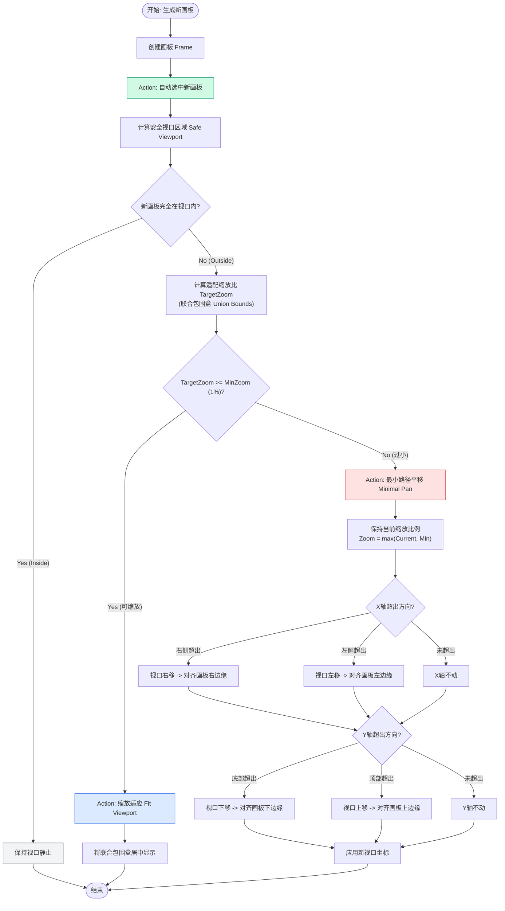

# 画布视口自适应逻辑流程图

> 请使用 VS Code / Trae 的 Markdown Preview 功能查看此图表 (Cmd + Shift + V 或点击右上角预览图标)。

## 规则说明

1.  **R1. 即时反馈原则 (Instant Selection)**
    *   新生成的画板必须立即自动选中。

2.  **R2. 视口稳定性原则 (Viewport Stability)**
    *   如果新生成的内容完全位于当前安全视口内，视口必须保持绝对静止。

3.  **R3. 分级自适应策略 (Tiered Adaptation Strategy)**
    *   **Tier A (Fit)**: 如果缩放后内容依然清晰（`>= 1%`），则缩放视口以容纳所有内容。
    *   **Tier B (Pan)**: 如果缩放后内容过小（`< 1%`），则放弃缩放，仅平移视口以展示新内容。

4.  **R4. 最小路径平移算法 (Minimal Path Pan)**
    *   在执行 Tier B 平移时，仅移动视口刚好露出新内容的距离。
