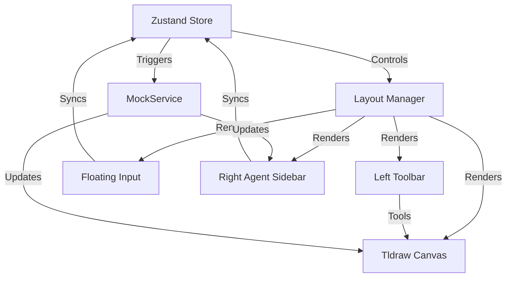

# Design: Agent Sidebar Integration

## Architecture

We will introduce a `LayoutManager` component that wraps the `Tldraw` canvas and orchestrates the UI components. State will be managed by `zustand`.



## Data Structures

### Store Interface
```typescript
interface AppState {
  // UI State
  isSidebarOpen: boolean;
  toggleSidebar: () => void;
  
  // Agent State
  prompt: string;
  setPrompt: (p: string) => void;
  generationSettings: {
    ratio: '1:1' | '16:9' | '4:3';
    resolution: '2k' | '4k';
  };
  setGenerationSettings: (s: Partial<GenerationSettings>) => void;
  
  // History
  chatHistory: ChatMessage[];
  addMessage: (msg: ChatMessage) => void;
}

interface ChatMessage {
  id: string;
  role: 'user' | 'assistant';
  content?: string;
  imageUrl?: string;
  timestamp: number;
}
```

## Component Breakdown

### 1. Left Toolbar (`LeftToolbar.tsx`)
- Vertical flex container.
- Contains standard Tldraw tool buttons (Select, Hand, Draw, etc.) + Custom "New Frame" button.
- Styling: White glassmorphism, vertical layout.

### 2. Unified Input (`UnifiedInput.tsx`)
- **Dual Mode**:
  - `Bottom`: Fixed position `bottom: 24`, `left: 50%`.
  - `Sidebar`: Relative position at bottom of sidebar flex container.
- **Features**:
  - Textarea (auto-resize).
  - Settings Toggles (Pills for Ratio/Res).
  - "Send" button.

### 3. Agent Sidebar (`AgentSidebar.tsx`)
- Fixed right position.
- Width: ~320px.
- Transition: Slide in/out.
- Content:
  - Header (Close button).
  - `ChatList` (Scrollable history).
  - `UnifiedInput` (In Sidebar mode).

## Sync Logic
When `generated()` is called:
1.  **Sidebar**: Adds `assistant` message with loading state -> updates to image.
2.  **Canvas**: Creates `AIFrameShape` at center of viewport (or near last user interaction) with loading state -> updates to image.
3.  **Consistency**: The image URL must be shared between the Sidebar chat item and the Canvas shape.

## Layout Changes to `index.css`
- Ensure `Tldraw` container adjusts width or is overlaid correctly.
- If Overlaid: Canvas remains full width, Sidebar floats on top. (Easier, preferred for "Infinite" feel).
